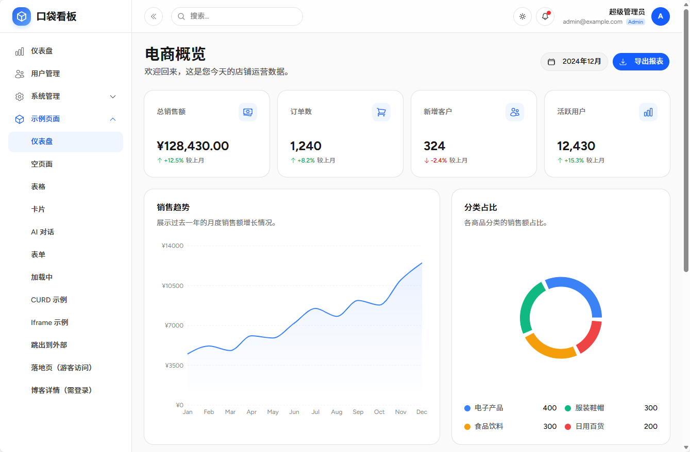
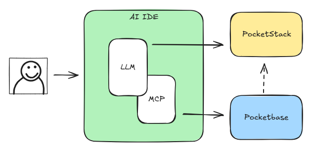

# Pocket Stack ：AI友好的全栈开发解决方案

2026年，最好的技术方案就是最“AI友好”的技术方案。这是一套AI友好的前后端技术栈，结合规则提示词和MCP等技术，打造一个非专业人员可用的 Vibe Coding 开发环境。为“就缺一个程序员”的你提供一个阿拉丁神灯般的开发平台。

基于 React + shadcn/ui + PocketBase + MCP 等技术，实现完整、流畅的全栈 Vibe Coding 开发体验。



## 📄 更多信息

- [文档](https://citywill.github.io/pocket-stack/)

## 基于 PockeStack 的 Vibe Coding 图示



## 🎶 Vibe Coding 效果

经过在多个开发 Agent 测试，Pocket Stack 可以使用免费的 Trae 表现出几乎完美的 Vibe Coding。

| IDE         | 大模型          | 打分 | 说明                                                        |
| ----------- | --------------- | ---- | ----------------------------------------------------------- |
| Trae 国内版 | MiniMax-M2.7 | 95分 | 可以实现vibe开发。几乎不需要补充debug提示词 |
| Trae 国内版 | Doubao-Seed-1.8 | 90分 | 可以实现vibe开发。一半功能一次成型，一半需要补充debug提示词 |
| Trae 国际版 | Ginimi-3-flash  | 95分 | 可以实现vibe开发。几乎不需要补充debug提示词 |

## 🌟 核心特性

- 🎨 **前端特性**：基于 shadcn/ui (Maia 风格) 与 Tailwind CSS v4，支持 Blue、Green、Red、Gray 四种主题颜色切换，内置亮色、深色、跟随系统模式。全站采用 Heroicons 图标库。自适应 Desktop、Tablet 及 Mobile 布局。
- 🚀 **后端特性**：原生集成 [PocketBase](https://pocketbase.io/)，覆盖身份验证及数据存储。
- 🧩 **模块化架构**：支持业务模块解耦开发，每个模块独立定义组件（`components/`）、迁移文件（`migrations/`）、包定义（`package.json`）、路由 (`routes.tsx`) 与菜单 (`menu.ts`)，实现即插即用。
- 📋 **业务示例**：内置个人任务管理系统，支持多状态流转、优先级设定及用户数据隔离。
- 🎪 **身份认证**：支持“超级管理员”与“普通管理员”登录模式。
- 🛡️ **权限控制**：
    - 路由级保护 (`ProtectedRoute`, `AdminOnlyRoute`)。
    - 侧边栏菜单根据角色动态过滤。
    - UI 自动根据权限进行降级或隐藏。
    - 后端 API Rules 确保租户/用户级数据物理隔离。

## 🌐 技术栈

| 领域          | 技术方案                     |
| :------------ | :--------------------------- |
| **后端/认证** | PocketBase                   |
| **前端框架**  | React 19 + TypeScript        |
| **构建工具**  | Vite                         |
| **UI 组件**   | shadcn/ui (@base-ui/react)   |
| **样式**      | Tailwind CSS v4 (Maia Style) |
| **路由**      | React Router v7              |
| **图标**      | HeroIcons React              |

## 📁 目录结构

```text
├── docs/                # 文档目录
├── public/              # 静态资源
└── src/
    ├── components/
    │   ├── layout/      # 布局组件 (Sidebar, Header, MainLayout)
    │   ├── ui/          # shadcn/ui 组件库
    │   ├── auth-provider.tsx # 认证上下文
    │   ├── menu.ts      # 全局菜单配置
    │   ├── protected-route.tsx # 路由守卫
    │   └── theme-provider.tsx # 主题上下文
    ├── lib/             # 工具库 (pocketbase, utils)
    ├── modules/         # 模块
    │   └── examples/    # 示例模块 (包含 CURD, AI Chat, Blog 等示例)
    │       ├── components/ # 模块组件
    │       ├── migrations/ # 模块数据库迁移文件
    │       ├── routes.tsx # 模块路由
    │       ├── menu.ts  # 模块菜单
    │       └── package.json # 模块包定义文件
    ├── pages/           # 系统页面
    │   ├── admin/       # 管理后台 (Dashboard, Settings, Users)
    │   ├── Login.tsx    # 登录页
    │   ├── Register.tsx # 注册页
    │   └── Profile.tsx  # 个人资料页
    ├── App.tsx          # 根组件
    └── main.tsx         # 入口文件
```

## 🚀 快速开始

### 1. 启动后端 (PocketBase)
1. 下载 [PocketBase](https://pocketbase.io/docs/) 二进制文件。
2. 运行 `./pocketbase serve`。
3. 访问 `http://127.0.0.1:8090/_/` 创建管理员账号并配置集合。

### 2. 运行前端

```bash
# 编辑 .env 文件，配置 PocketBase 后端地址
cp .env.example .env

# 安装依赖
npm install

# 启动开发服务器
npm run dev
```

## 联系和讨论

添加微信好友，加微信入群，备注 pocketstack

