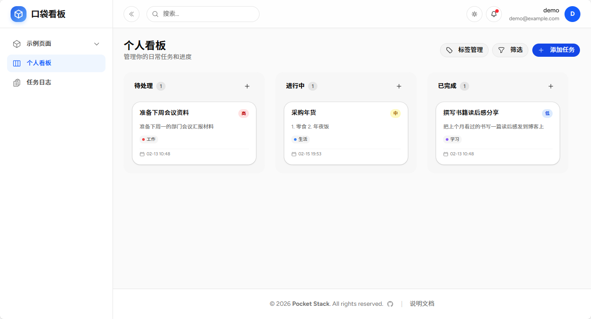
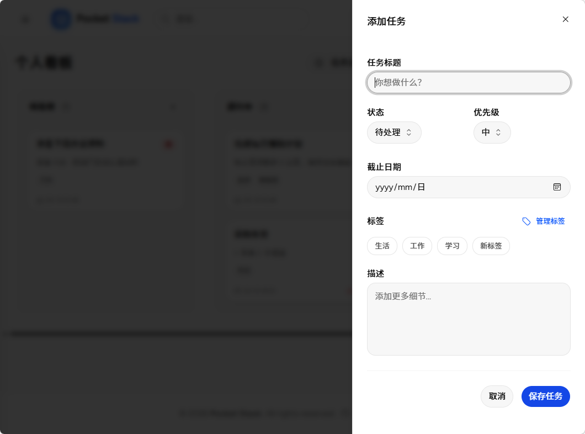
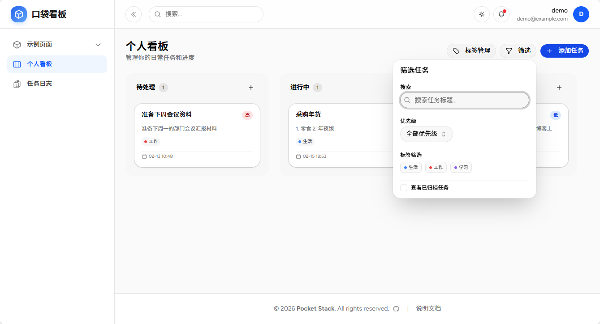
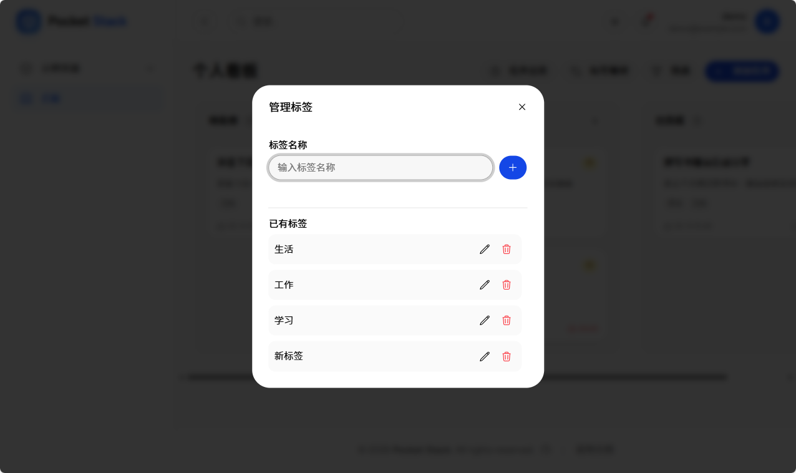
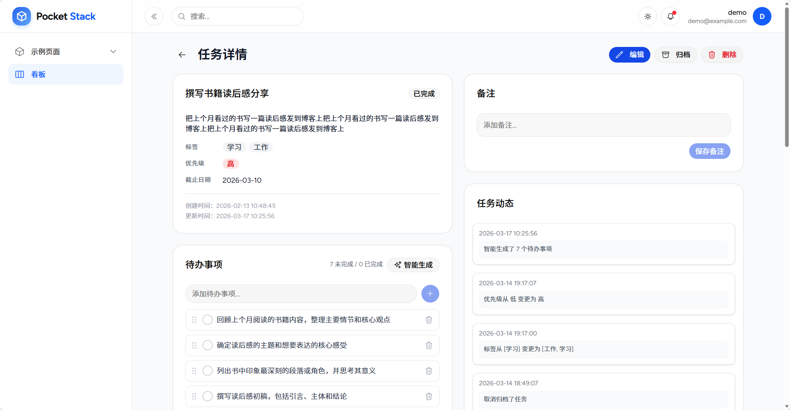
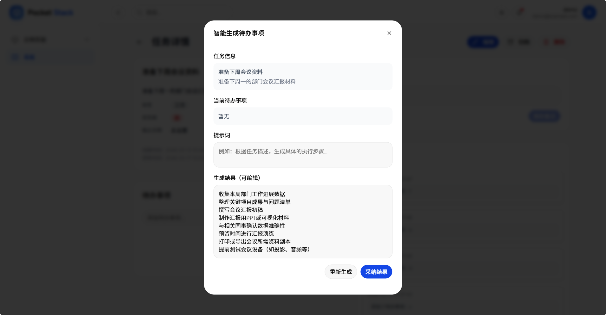
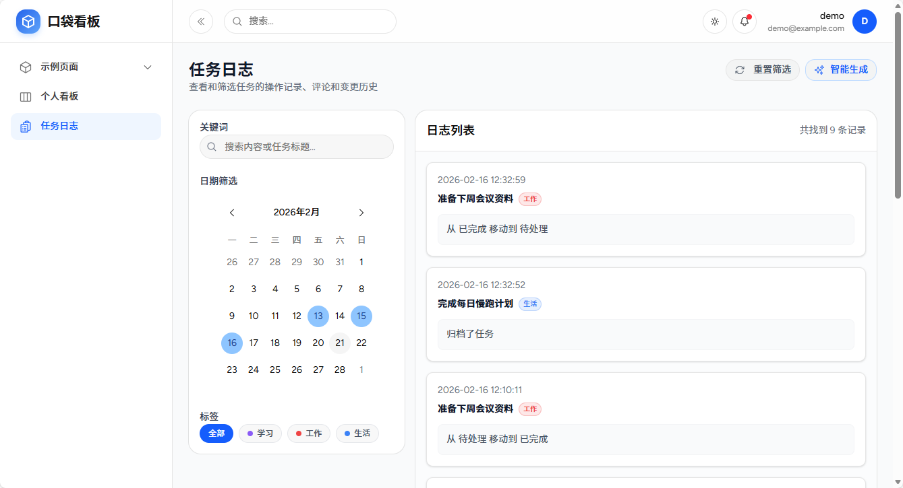
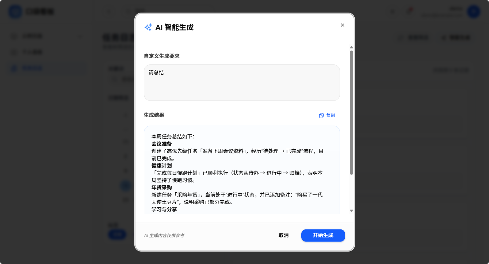

# 口袋看板

口袋看板是基于 `Pocket Stack` 通过 `Vibe Coding` 的方式开发的一款个人任务管理看板，提供个人任务管理和进度追踪功能。

## 看板页面

### 访问看板

访问 `/kanban` 路径，打开口袋看板页面，默认展示个人看板视图。

任务按状态分布在【待处理】、【进行中】、【已完成】三个列中，支持拖拽移动任务以更新状态。

### 添加任务

点击右上角的【添加任务】按钮，可以创建新的任务卡片。任务属性包括任务标题、状态、优先级、截止日期、标签、描述等。

### 筛选任务

点击【筛选】按钮，可以按关键词、优先级、标签、归档状态等筛选任务。

### 标签管理

点击【标签管理】按钮，可以添加或编辑任务标签。

## 任务页面

### 任务详情

点击任务卡片可以查看任务信息，管理任务的待办事项，添加备注，以及浏览任务动态。

- 任务信息：包括任务标题、状态、描述、标签、优先级、截止日期等。
- 待办事项：对该任务下的待办事项进行添加、删除、修改、排序等操作。
- 备注：记录在任务执行过程中的任何信息。
- 任务动态：展示任务的状态变更历史，包括创建、状态变更、备注信息、待办事项变更等操作。

### 待办事项智能生成

基于任务标题、描述等上下文，根据用户要求，自动生成如待办事项列表。

## 日志页面

### 任务日志

任务日志展示任务的状态变更历史，包括创建、状态变更、备注等操作。可以通过关键词、日期、标签对任务日志进行筛选。

### 任务日志智能生成

基于当前筛选条件结果的任务日志上下文，根据用户要求生成如总结、计划等内容。

