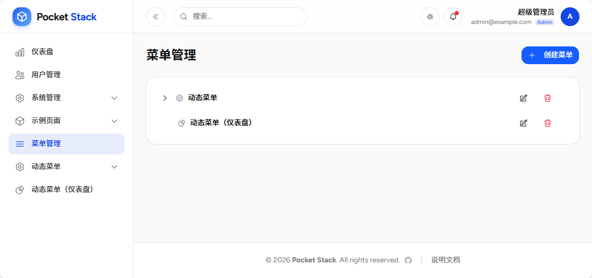
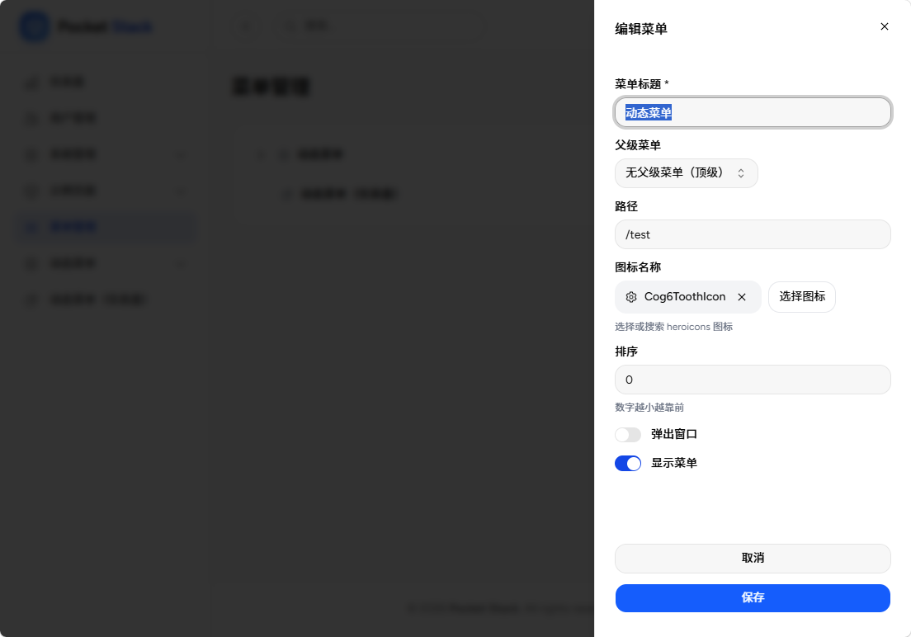

# 菜单管理模块

PocketStack 的[菜单定义机制](/菜单定义.html)主要依靠模块中的`menu.ts`文件定义。该方案尤其适合 vibe coding 开发场景。缺点是一旦程序构建完成，菜单配置就无法动态修改了。

本模块弥补了这一缺陷，提供基于数据库的菜单动态管理和配置功能。

## 功能特性

- **树形结构展示**：支持二级嵌套的菜单结构
- **拖拽排序**：通过排序字段调整菜单顺序
- **图标选择**：集成 Heroicons 图标选择器
- **外部链接**：支持跳转到外部 URL
- **显示/隐藏**：可控制菜单项是否在侧边栏显示

## 模块安装

1. 将 `menu` 目录复制到 `src/modules` 目录下
2. 将 `src/modules/menu/migrations/menu_items.json` 文件导入到 pocketbase 中。

完成以上步骤后，即可使用模块管理动态菜单，系统也会自动发现并将数据库中存在的菜单项加载到左侧菜单。

## 模块使用

### 菜单配置

模块安装后，即可在左侧菜单中显示`菜单管理`链接，点击后即可进入菜单管理页面。

### 创建/编辑菜单

点击右上角的`创建菜单`按钮，或点击菜单列表右侧的编辑图标，即可弹出表单，进行创建/编辑操作。

### 菜单的显示规则

1. 只有打开了`显示菜单`开关的表单项才能在侧边栏显示。
2. 动态菜单会在模块菜单下面展示。