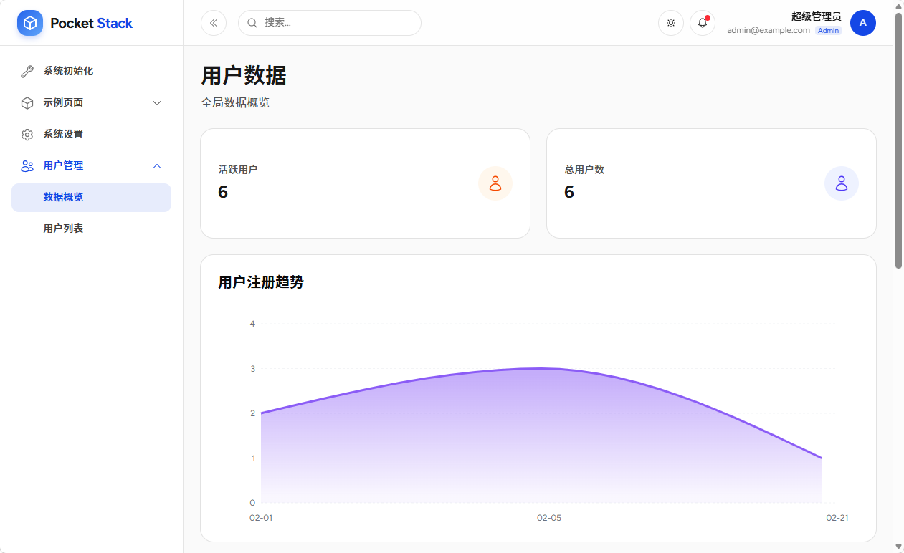
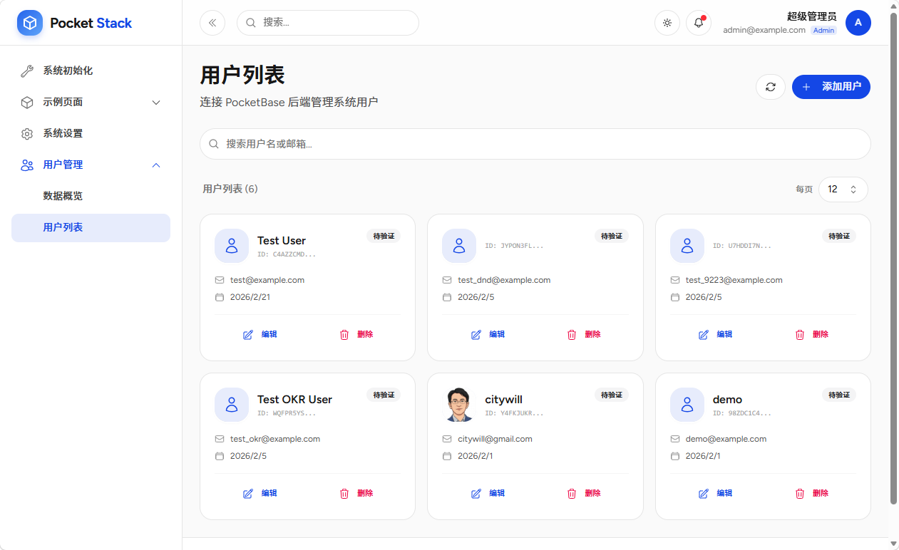

# 用户管理模块

用户管理模块提供系统用户的仪表盘统计和列表管理功能，支持查看用户注册趋势、创建/编辑/删除用户等操作。

## 模块信息

| 属性 | 值 |
|------|-----|
| **包名** | `@pocketstack/user` |
| **版本** | `1.0.0` |
| **类型** | `module` |
| **权限** | `adminOnly` (仅超级管理员) |

## 页面结构

| 页面 | 路径 | 说明 |
|------|------|------|
| 数据概览 | `/user` | 用户仪表盘，包含统计卡片和注册趋势图 |
| 用户列表 | `/user/list` | 用户列表，支持分页、搜索、创建、编辑、删除 |

## 数据概览



用户仪表盘展示以下信息：

### 统计卡片

- **活跃用户** — 当前系统用户总数
- **总用户数** — 与活跃用户同值

### 用户注册趋势图

基于 `recharts` 的面积图，展示每日用户注册数量趋势。

数据来源：PocketBase `users` collection，按 `created` 字段聚合每日注册用户数。

## 用户列表



用户列表提供完整的用户管理能力。

### 功能列表

- **分页浏览** — 每页默认 12 条，支持切换每页数量
- **关键词搜索** — 按姓名或邮箱模糊搜索，500ms 防抖
- **创建用户** — 填写邮箱、姓名、密码、邮箱可见性
- **编辑用户** — 修改姓名、密码、邮箱可见性、头像
- **删除用户** — 确认后删除，带二次确认对话框
- **头像上传** — 支持预览，上传至 PocketBase 文件存储

### 字段说明

| 字段 | 类型 | 说明 |
|------|------|------|
| `email` | string | 用户邮箱，唯一标识 |
| `name` | string | 用户姓名 |
| `avatar` | file | 用户头像图片 |
| `verified` | bool | 邮箱是否已验证 |
| `created` | datetime | 注册时间 |
| `password` | string | 登录密码 (仅创建时必需) |

## 依赖

本模块依赖以下 peerDependencies：

```json
{
  "react": "^19.0.0",
  "react-dom": "^19.0.0"
}
```

本模块使用了以下第三方组件库：

- `recharts` — 趋势图表
- `@heroicons/react` — 图标库
- `sonner` — Toast 提示
- shadcn/ui 组件库

## PocketBase Collection

模块使用 PocketBase 内置的 `users` collection 作为数据源，无需额外创建。

## 路由配置

```tsx
<Route element={<ProtectedRoute />}>
  <Route element={<MainLayout />}>
    <Route element={<AdminOnlyRoute />}>
      <Route path="/user" element={<UserDashboard />} />
      <Route path="/user/list" element={<UserList />} />
    </Route>
  </Route>
</Route>
```
