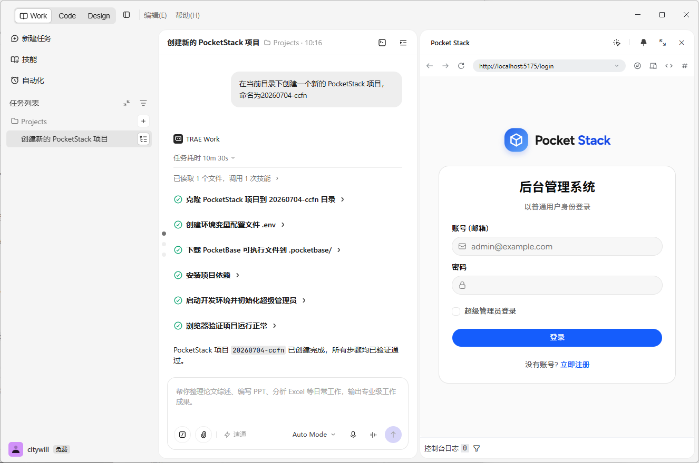

# 2026年7月版本发布说明

本月主要完善了示例模块和文档体系。新增 Markdown 渲染示例页面，支持模块 README 在系统内查看和渲染增强。同时全面补充了项目文档，包括模块 README、skill 安装指南、菜单排序功能说明，并优化了开发环境配置和启动脚本。

## 新特性

### 开发环境前后端启动集成

- 新约定：项目目录下新增 `.pocketbase` 目录（git ignore），存放pocketbase相关文件。
- 使用智能体初始化：`pocketstack skill`（https://github.com/citywill/pocketstack-skill） 包含 pocketstack 的初始化能力，使用安装了该 skill 的智能体，可通过一句提示词自动实现从克隆到运行的全过程。
- 一键启动：调整开发启动脚本，通过 `npm run dev` 或 `pnpm dev`，可同时启动项目前端开发环境和pocketbase程序。

### 示例模块增加 Markdown 渲染示例

新增 Markdown 渲染展示页面，基于 react-markdown + github-markdown-css，支持编辑/预览双 Tab 切换。

### 模块管理增加模块说明查看

支持在系统内查看各模块的 README 文档。

### 菜单新增排序属性

补充菜单排序功能，支持 order 配置，菜单项可按权重排序。

## 功能增强

- 文档
  - 为所有内置模块添加 README 文档
  - AGENTS.md 补充示例模块功能列表、模块目录结构示例和说明
  - 文档站补充 skill 安装指南和使用流程
  - 重构 README 文档，完善安装部署流程
  - 补全项目初始化指南和目录说明
