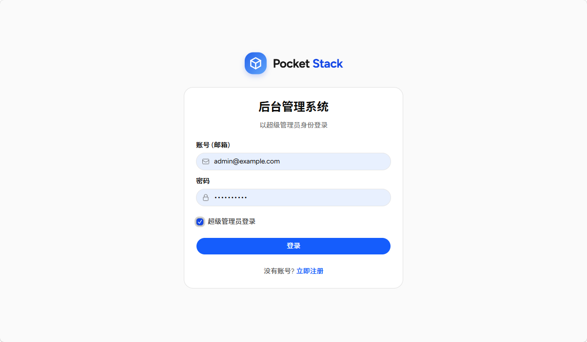
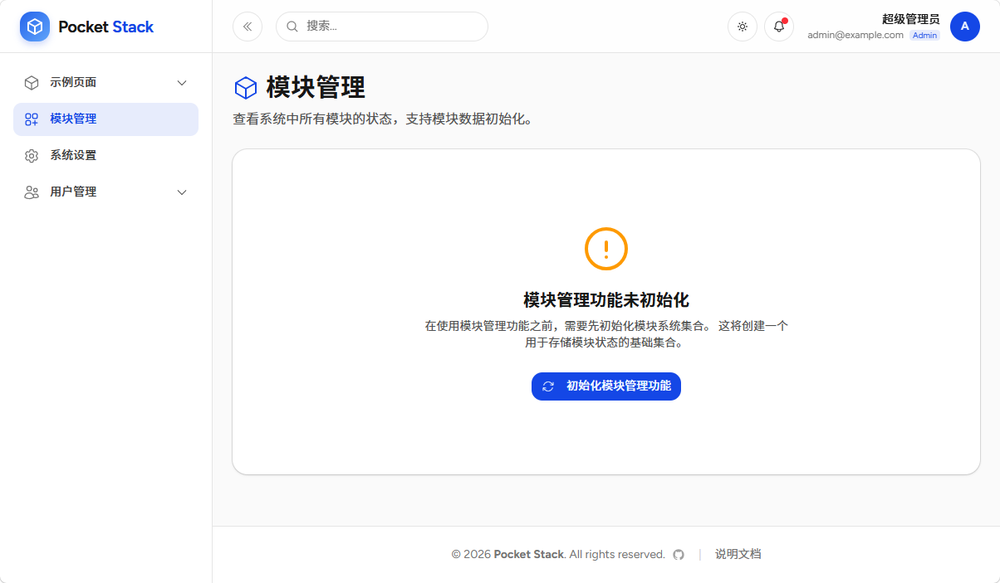
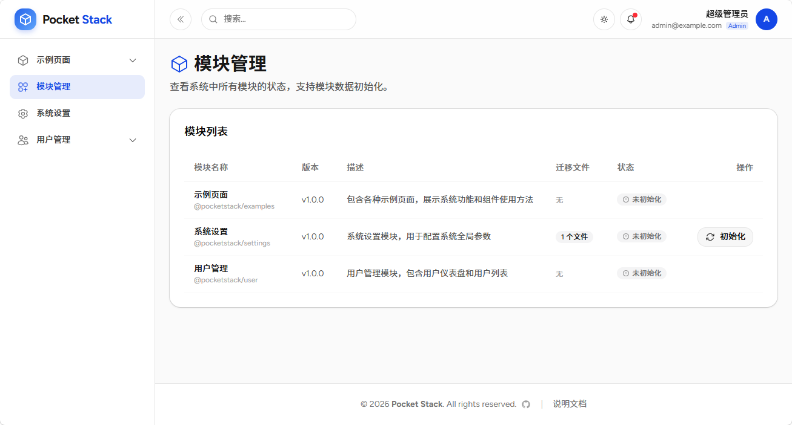

# 初始化和模块管理

首次访问系统时，需要进行系统模块初始化工作。

## 管理员登录

使用 PocketBase 初始化时创建的管理员账号和密码登录 PocketStack。

## 初始化模块系统

点击页面侧边栏 `模块管理` 菜单，点击 `初始化模块管理功能` 按钮。

模块管理也是一个特殊的模块，只有先初始化该模块，才能对其它模块进行管理。有一些模块需要初始化才能正常使用。比如`系统设置`模块就需要初始化，而`示例页面`模块则不需要初始化。

