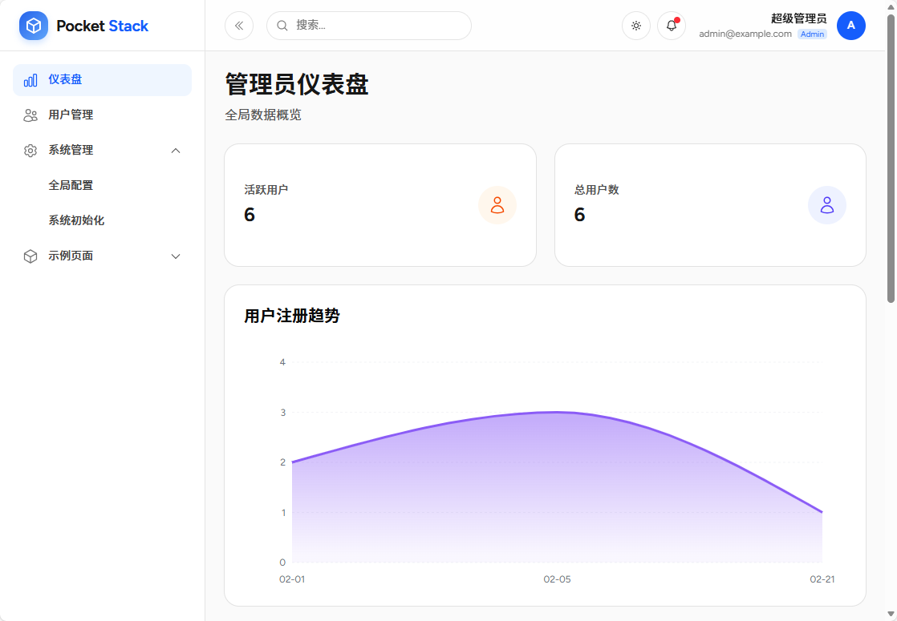
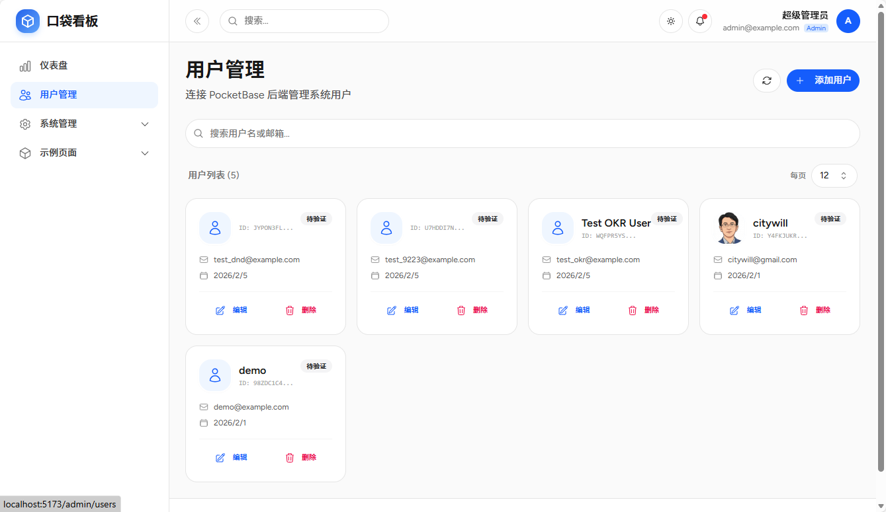
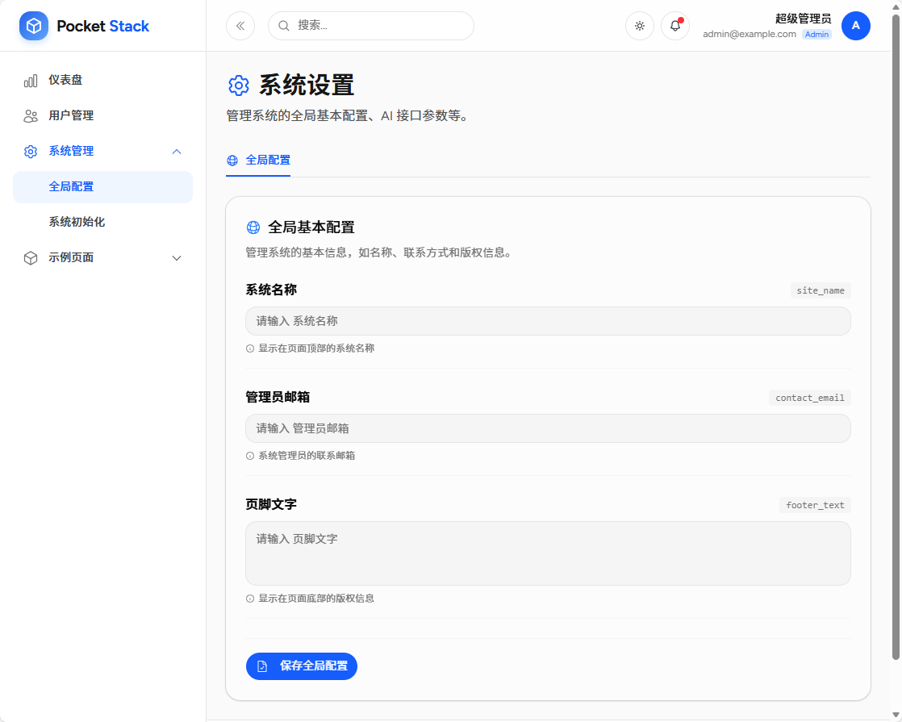

# 后台管理功能

后台管理模块为系统管理员提供了一系列工具，用于监控系统状态、管理用户以及配置系统参数。该模块仅对拥有管理员权限的用户可见。

## 用户管理

### 用户仪表盘

- **关键指标统计**: 实时显示“活跃用户数”和“总用户数”。
- **用户增长趋势**: 通过图表直观展示用户注册随时间的变化趋势，支持交互式查看具体日期的注册人数。

### 用户列表

用户管理页面允许管理员对系统用户进行全生命周期的管理。

- **用户列表**: 分页展示系统中的所有用户（每页 12 条），显示头像、姓名、邮箱、验证状态及注册时间。
- **搜索过滤**: 支持通过姓名或邮箱关键词快速查找用户。
- **创建用户**: 管理员可以直接创建新用户，需填写邮箱、姓名、密码，并可上传头像。
- **编辑用户**: 支持修改现有用户的信息，包括姓名、邮箱、验证状态（是否已验证邮箱）及头像。
- **删除用户**: 提供安全确认机制，允许管理员删除违规或废弃的用户账号。

## 系统设置

系统设置模块提供了对应用全局参数的配置能力。

- **动态配置表单**: 系统根据配置自动加载不同的设置分组（如：全局配置）。
- **参数持久化**: 所有配置项均存储在数据库的 `system_settings` 集合中，确保配置持久生效。
- **实时生效**: 修改后的配置通常无需重启服务即可在系统中生效（取决于具体配置项的使用方式）。

