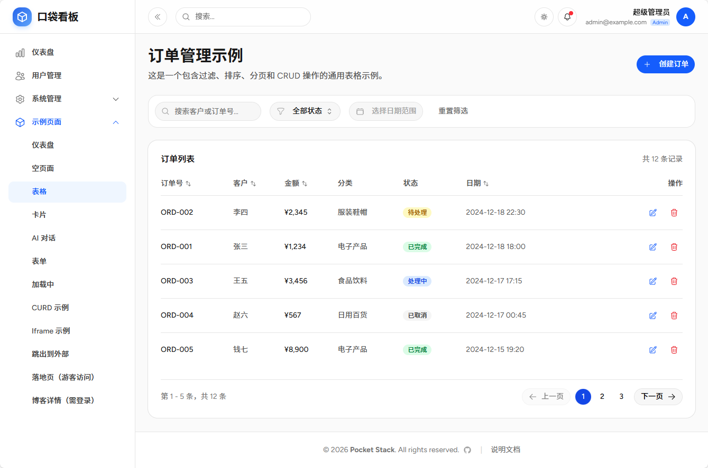
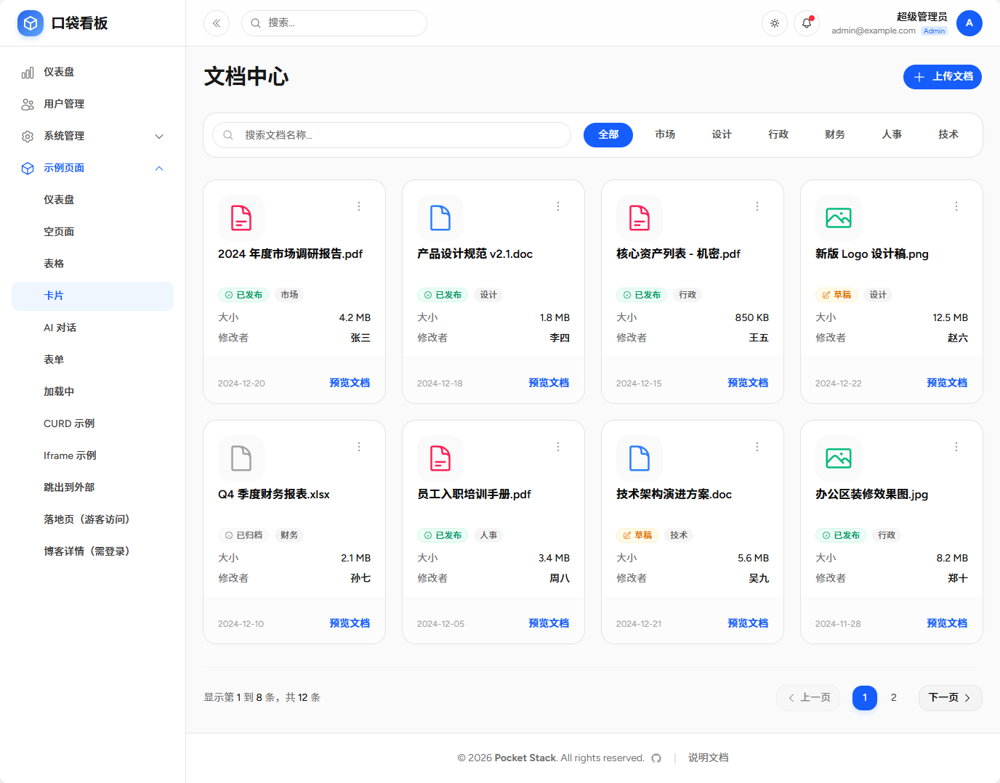
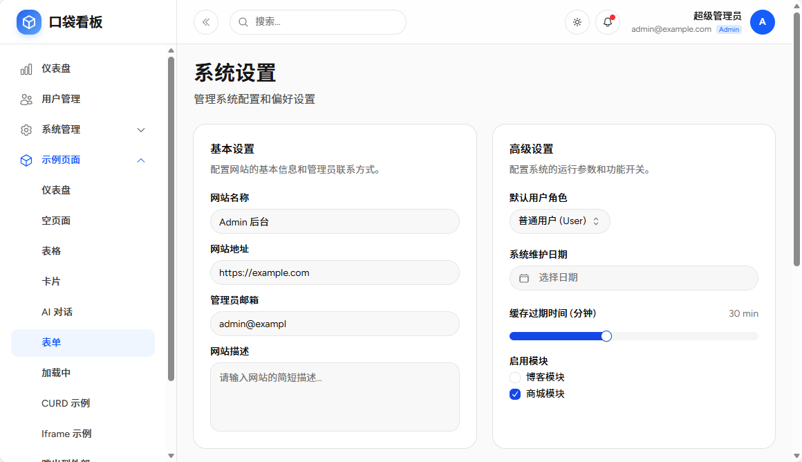
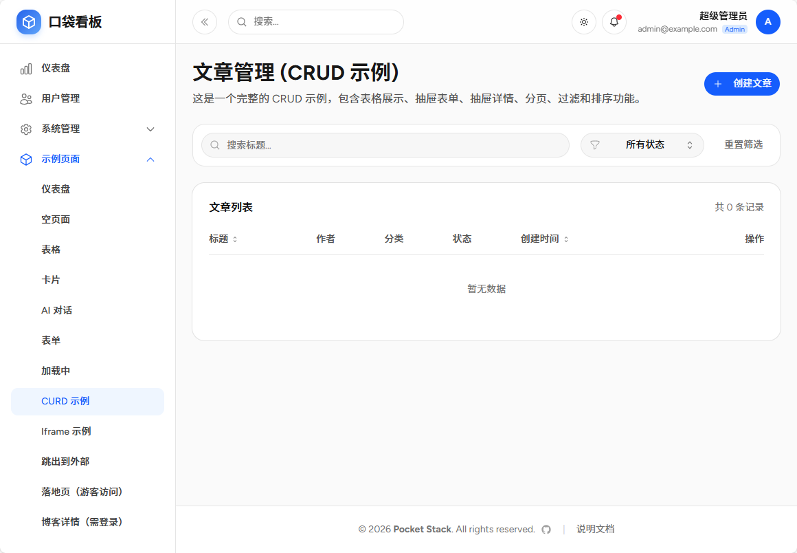
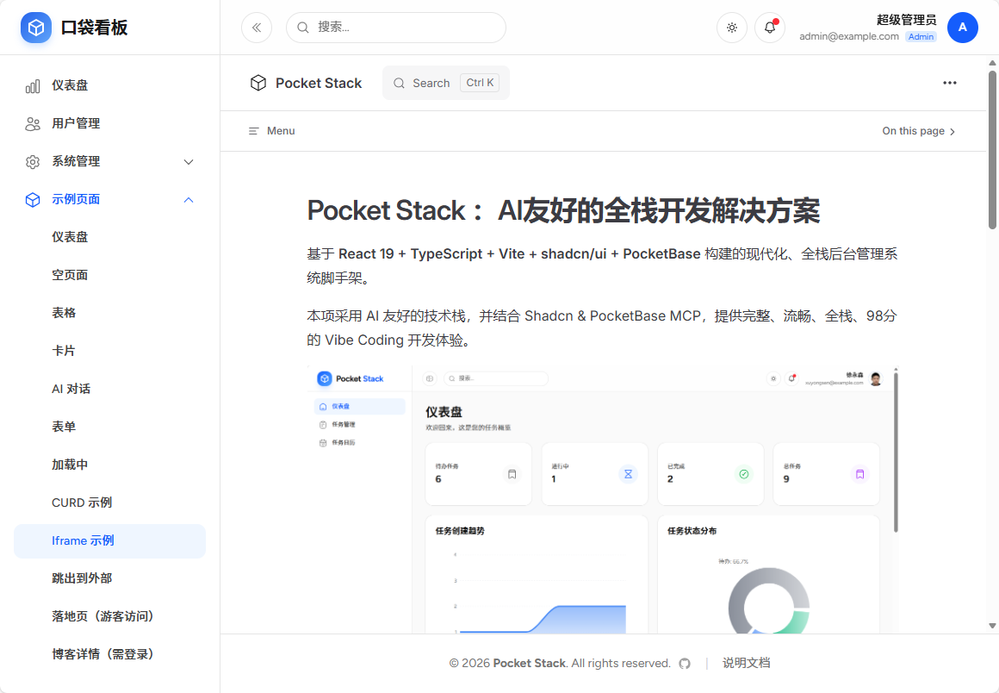
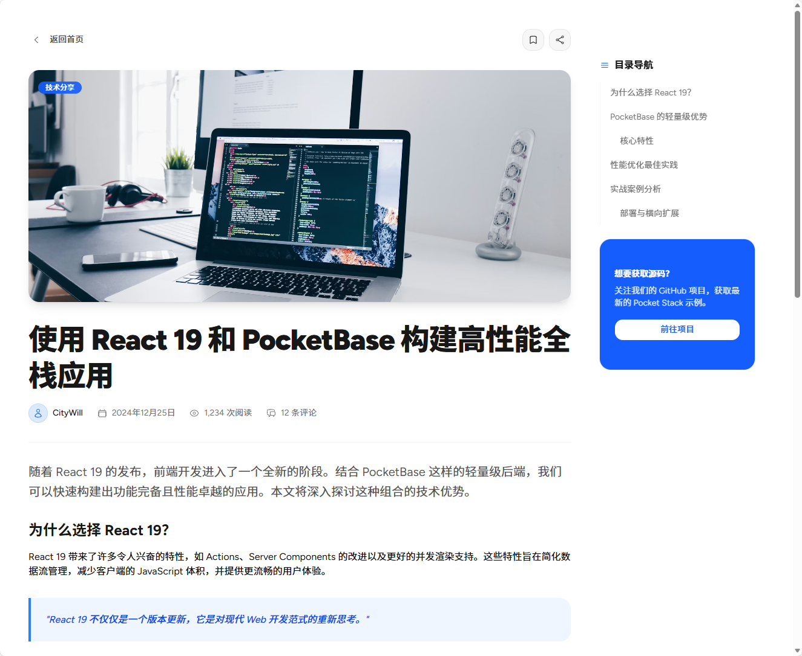

# 示例模块

示例模块展示了基于 Pocket Stack 框架开发的各类典型页面和功能组件。这些示例代码位于 `src/modules/examples` 目录下，可作为开发新功能的参考模板。

## 模块定义

### 模块包定义

模块包定义文件位于 `src/modules/examples/package.json`，用于声明模块的名称、版本、标题、描述以及依赖。

注意：依赖不要和系统包文件的依赖冲突、重复。

```json
{
  "name": "@pocketstack/examples",
  "version": "1.0.0",
  "title": "示例页面",
  "description": "包含各种示例页面，展示系统功能和组件使用方法",
  "private": true,
  "type": "module",
  "dependencies": {
    "@uiw/react-md-editor": "^4.0.4"
  },
  "peerDependencies": {
    "react": "^19.0.0",
    "react-dom": "^19.0.0"
  }
}
```

### 路由定义

路由定义文件位于 `src/modules/examples/routes.tsx`，使用 React Router 定义页面路由。

- 路由通过 `ProtectedRoute` 保护，需要用户登录后才能访问。
- 使用 `MainLayout` 作为后台管理布局。
- 部分页面（如落地页）无需后台布局，直接渲染。

```tsx
import { Route } from 'react-router-dom';
import { ProtectedRoute } from '@/components/protected-route';
import { MainLayout } from '@/components/layout';

export const routes = (
  <>
    {/* 需要登录访问的路由 */}
    <Route element={<ProtectedRoute />}>
      <Route path="/" element={<MainLayout />}>
        <Route path="examples/dashboard" element={<ExampleDashboard />} />
        <Route path="examples/blank" element={<Blank />} />
        <Route path="examples/table" element={<ExampleTable />} />
        <Route path="examples/card" element={<ExampleCard />} />
        <Route path="examples/form" element={<Form />} />
        <Route path="examples/chat" element={<AiChat />} />
        <Route path="examples/loading" element={<Loading />} />
        <Route path="examples/curd" element={<CurdExample />} />
        <Route path="examples/iframe" element={<IframePage />} />
        <Route path="examples/markdown" element={<MarkdownEditor />} />
        <Route path="blog-detail" element={<BlogDetail />} />
      </Route>
    </Route>
    {/* 无需后台框架布局的页面 */}
    <Route path="examples/portal/landing" element={<LandingPage />} />
    <Route path="examples/portal/blog-detail" element={<BlogDetail />} />
  </>
);
```

### 菜单定义

菜单定义文件位于 `src/modules/examples/menu.ts`，使用 Heroicons 图标库。

- `title`: 菜单标题
- `icon`: 菜单图标（Heroicons）
- `children`: 子菜单项数组
- 子菜单项支持 `external`（外部链接）、`show`（显示/隐藏）等配置

```typescript
import { CubeIcon } from '@heroicons/react/24/outline';

export const menu = {
  title: '示例页面',
  icon: CubeIcon,
  children: [
    { title: '仪表盘', path: '/examples/dashboard' },
    { title: '空页面', path: '/examples/blank' },
    { title: '表格', path: '/examples/table' },
    { title: '卡片', path: '/examples/card' },
    { title: 'AI 对话', path: '/examples/chat' },
    { title: '表单', path: '/examples/form' },
    { title: '加载中', path: '/examples/loading' },
    { title: 'CURD 示例', path: '/examples/curd' },
    { title: 'Markdown 编辑器', path: '/examples/markdown' },
    { title: 'Iframe 示例', path: '/examples/iframe' },
    { title: '跳出到外部', path: 'https://citywill.github.io/pocket-stack', external: true },
    { title: '隐藏菜单', path: 'https://citywill.github.io/pocket-stack/login', show: false },
    { title: '落地页（游客访问）', path: '/examples/portal/landing', external: true },
    { title: '博客详情（需登录）', path: '/examples/portal/blog-detail', external: true },
  ],
};
```

## 示例页面

### 仪表盘 (Dashboard)

展示了数据可视化页面的实现方式。

- **路径**: `/examples/dashboard`
- **文件**: `src/modules/examples/Dashboard.tsx`
- **主要功能**:
    - 集成 `recharts` 图表库。
    - 展示关键指标卡片（KPI Cards）。
    - 包含面积图（AreaChart）和饼图（PieChart）示例。
    - 响应式布局设计。


### 表格示例 (Table)

展示了复杂数据表格的交互实现。

- **路径**: `/examples/table`
- **文件**: `src/modules/examples/Table.tsx`
- **主要功能**:
    - 数据分页、排序和筛选。
    - 搜索功能集成。
    - 状态徽章（Badge）展示。
    - 包含新建、编辑、删除等操作按钮布局。
    - 使用 Dialog 和 Alert Dialog 进行交互确认。



### 卡片列表 (Card)

展示了以卡片形式呈现数据的布局方式，适用于文档管理、商品展示等场景。

- **路径**: `/examples/card`
- **文件**: `src/modules/examples/Card.tsx`
- **主要功能**:
    - 网格布局（Grid Layout）展示卡片。
    - 卡片包含图片、标题、元数据和操作菜单。
    - 支持下拉菜单操作。
    - 搜索和过滤工具栏。



### 表单示例 (Form)

展示了系统设置类的表单页面布局。

- **路径**: `/examples/form`
- **文件**: `src/modules/examples/Form.tsx`
- **主要功能**:
    - 标准表单布局。
    - 包含输入框、单选、多选、下拉选、日期、滑块、开关以及重置和提交按钮。
    - 分组卡片式表单设计。



### AI 对话 (AI Chat)

展示了类似 ChatGPT 的对话界面实现。

- **路径**: `/examples/chat`
- **文件**: `src/modules/examples/AiChat.tsx`
- **主要功能**:
    - 聊天消息列表自动滚动到底部。
    - 支持 Markdown 内容渲染（`react-markdown`）。
    - 模拟流式对话交互体验。
    - 输入框自动聚焦和发送处理。


### CURD 示例 (CRUD Example)

展示了基于 PocketBase 后端的完整增删改查功能。

- **路径**: `/examples/curd`
- **文件**: `src/modules/examples/curd/Index.tsx`
- **主要功能**:
    - **后端集成**: 直接调用 PocketBase SDK 操作 `examples_posts` 集合。
    - **列表管理**: 服务端分页、搜索、状态过滤。
    - **抽屉表单**: 使用 Drawer 组件进行新建和编辑操作（`PostFormDrawer`）。
    - **详情查看**: 使用 Drawer 组件查看数据详情（`PostDetailDrawer`）。
    - **数据定义**: 包含 TypeScript 类型定义和迁移文件。



### Markdown 编辑器 (Markdown Editor)

展示了基于 `@uiw/react-md-editor` 的 Markdown 富文本编辑器实现。

- **路径**: `/examples/markdown`
- **文件**: `src/modules/examples/MarkdownEditor.tsx`
- **主要功能**:
    - 左侧编辑，右侧实时预览。
    - 支持 GFM (GitHub Flavored Markdown) 语法。
    - 支持代码高亮、表格、任务列表等。
    - 内置工具栏，支持常用格式化操作。
    - 一键复制 Markdown 内容。

### Iframe 集成

展示了如何在应用内嵌入外部网页。

- **路径**: `/examples/iframe`
- **文件**: `src/modules/examples/IframePage.tsx`
- **主要功能**:
    - 全屏嵌入外部 URL。
    - 自适应高度布局。



### 其他页面

- **空页面**: `/examples/blank` - 基础的页面骨架。
- **加载中**: `/examples/loading` - 加载状态演示。
- **外部链接**: 菜单支持配置外部链接跳转。
- **门户页面**:
    - 落地页: `/examples/portal/landing` (无后台布局)
    - 博客详情: `/examples/portal/blog-detail`





## 目录结构

```
src/modules/examples/
├── package.json        # 模块包定义
├── menu.ts             # 菜单配置
├── routes.tsx          # 路由配置
├── AiChat.tsx          # AI 对话
├── Blank.tsx           # 空页面
├── BlogDetail.tsx      # 博客详情
├── Card.tsx            # 卡片列表
├── Dashboard.tsx       # 仪表盘
├── Form.tsx            # 表单页
├── IframePage.tsx      # Iframe页
├── LandingPage.tsx     # 落地页
├── Loading.tsx         # 加载页
├── MarkdownEditor.tsx  # Markdown 编辑器
├── Table.tsx           # 表格页
└── curd/               # CURD 完整示例模块
    ├── Index.tsx
    ├── components/
    │   ├── PostDetailDrawer.tsx
    │   └── PostFormDrawer.tsx
    ├── migrations/
    │   └── examples_posts.json
    └── types.ts
```
